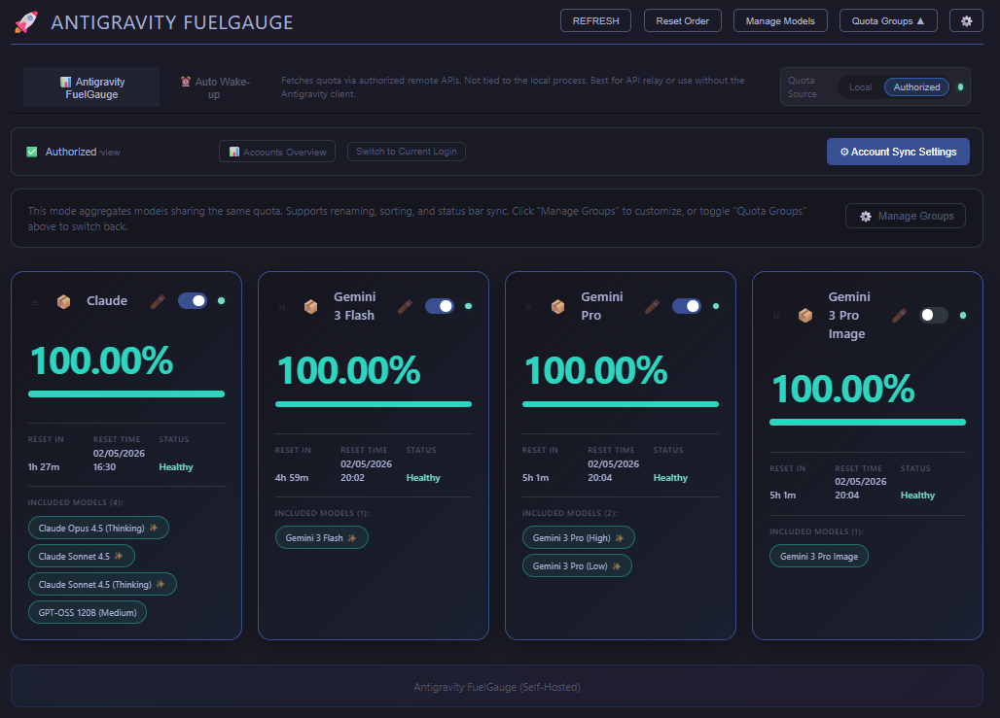

# Antigravity FuelGauge

A secure, self-hosted quota fuel gauge for Antigravity AI.



## Features

- 📊 **Real-time quota monitoring** - Track Claude, Gemini, and other AI model usage
- 🔄 **Auto-refresh** - Configurable refresh intervals with manual refresh option
- 📱 **Multi-account support** - Manage multiple Antigravity accounts
- 🎨 **Quota Groups** - Aggregate models sharing the same quota pool
- 🔔 **Threshold alerts** - Warning and critical notifications when quota runs low
- 🔒 **Secure by design** - Credentials stored in VS Code SecretStorage (encrypted)

## Security

This is a **secure fork** that addresses vulnerabilities found in similar extensions:

- ✅ **No plaintext credential storage** - Uses VS Code's encrypted SecretStorage only
- ✅ **No WebSocket server** - No unauthenticated network listeners
- ✅ **No telemetry** - Telemetry permanently disabled
- ✅ **Localhost only** - All API calls stay on your machine

## Building the Extension

```bash
npm install
npm run compile
npm run package
```

This will generate a `.vsix` file (e.g., `antigravity-fuelgauge-2.1.6.vsix`).

## Installing the Extension

```bash
code --install-extension antigravity-fuelgauge-2.1.6.vsix
```

Or install manually via Google's Antigravity IDE:
1. Open Google's Antigravity IDE
2. Go to Extensions (Ctrl+Shift+X)
3. Click the `...` menu → "Install from VSIX..."
4. Select the generated `.vsix` file

## License

[MIT](LICENSE)
